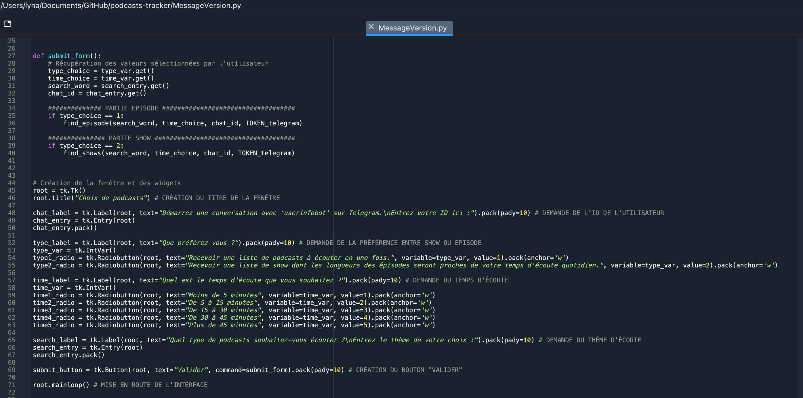

```{r setup, include=FALSE}
knitr::opts_chunk$set(echo = FALSE)
```

## Introduction

-   Constat : il n'existe pas de moyens pour filtrer les résultats par durée sur Spotify
-   Création d'un outil pour chercher des podcasts/émissions par durée
-   Démonstration de l'outil

## Mise en place du projet

1.  Utilisation de Spotify pour notre projet à l'aide du package Python Spotipy\
    [Fonction principale que nous avons utilisé]{.underline} :

    {width="209"}

    [NB]{.underline} : distinction entre émission et épisode, impossibilité de faire des recherches par durée même depuis l'API

## Mise en place du projet

2.  Création d'un Bot Telegram pour envoyer les résultats afin d'obtenir les liens directement sur son téléphone

    {width="252"}

    -   Récupération du Token afin de connecter son code Python à son Bot Telegram

## Premier problème rencontré

-   Documentation très dense sur l'API Telegram, manque de temps pour créer un bot de qualité\
    ---\> Pas de réelle conversation sur Telegram comme on l'imaginait
-   Création d'une interface graphique à l'aide du package Tkinter

{width="431"}

## Traitement des émissions

-   Explication partie émission

## Traitement des épisodes

-   Explication partie épisode

## Conclusion

-   Difficultés qui émergent quand chacun travaille de son côté
-   Extension possible : Bot Telegram complet
